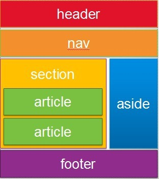
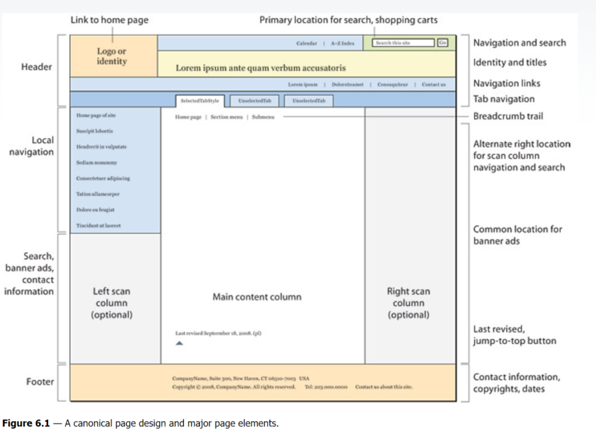

## 19.12.26(토)

UI레이아웃을 위한 HTML 태그

### [html layouts tag](https://www.google.com/search?q=html+layouts+tag&source=lnms&tbm=isch&sa=X&ved=2ahUKEwjg9r6SjdbmAhUD62EKHaTaB9MQ_AUoAXoECA0QAw&biw=971&bih=922&dpr=2#imgrc=_)

### [html structure design](https://www.google.com/search?q=html+structure+design&source=lnms&tbm=isch&sa=X&ved=2ahUKEwjGvtedjdbmAhVVeXAKHfOQAKMQ_AUoAXoECA0QAw&biw=971&bih=922#imgrc=4ubeOcY58VQKsM:)

